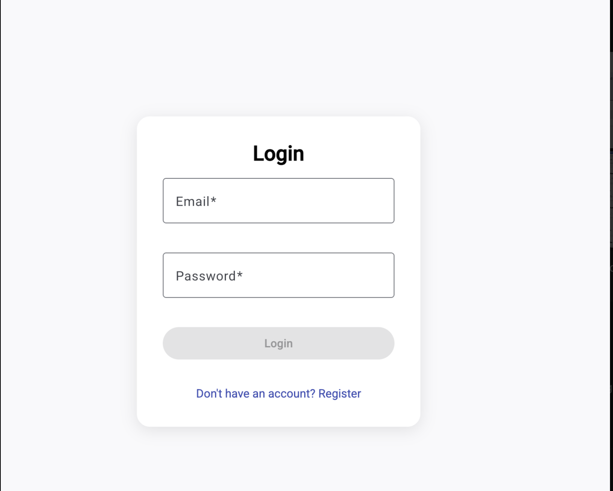
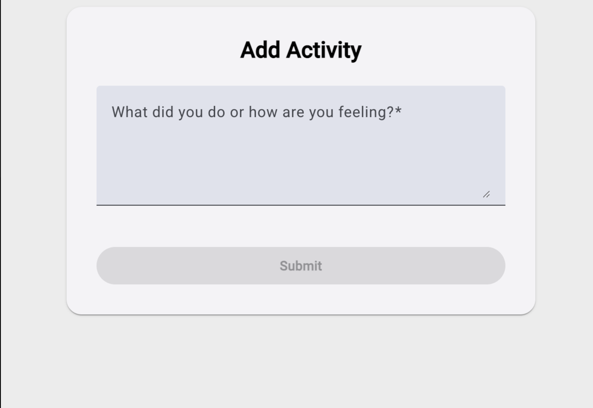
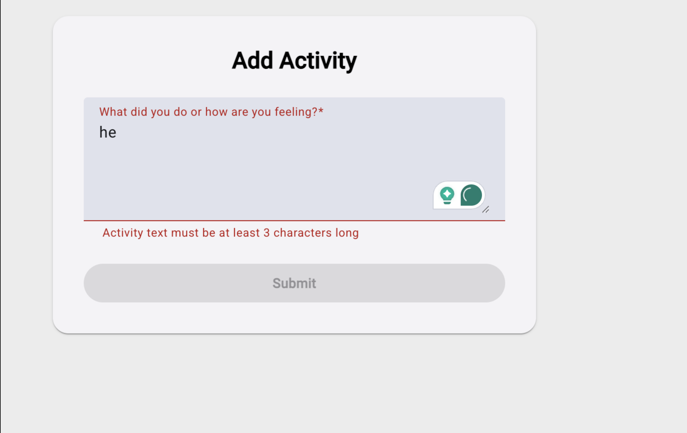
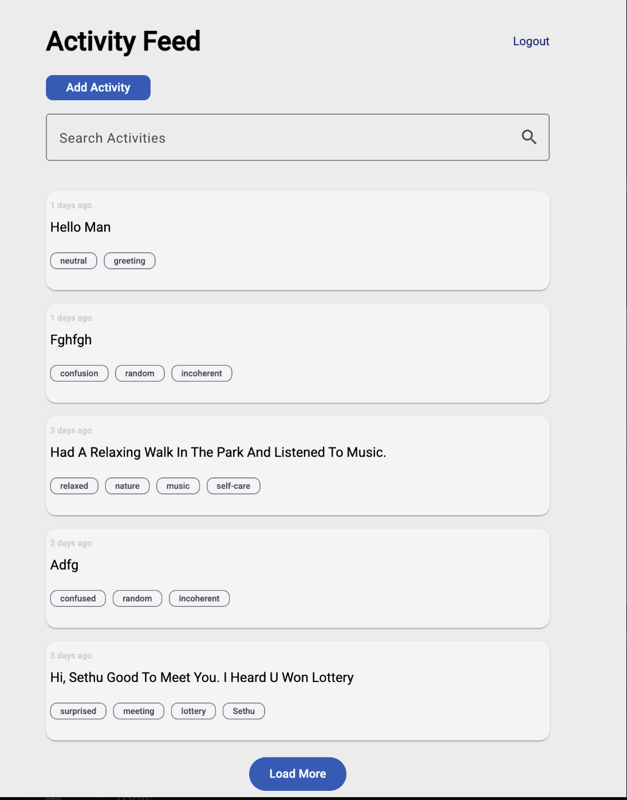

# 📝 Daily Activity Journal (test3)

The **Daily Activity Journal** is a modern web application built with **Angular 18** and **Firebase** that enables users to log their daily activities or moods. It uses OpenAI to intelligently tag and categorize entries by mood and keywords.

### 🔗 Live Demo (Optional)
_Add your hosted project URL here_

---

## 🚀 Features

- 🔐 **Authentication** (Login/Register) with Firebase Auth  
- ✍️ **Log Activity** with AI-powered **mood detection** and **tagging**  
- 🔎 **Search** activities by keyword  
- 🧠 **AI Tag Suggestions** (via OpenAI)  
- 📄 Clean and minimal **UI using Angular Material**  
- 📦 **Pagination** and **lazy loading**  
- 🕵️ Secure Firestore queries (sensitive fields excluded on frontend)

---

## 📸 Screenshots

### ✅ Login

### 🧘 Add Activity

### ❗ Validation Error

### 📋 Activity Feed with Search

---

## 🔧 Tech Stack

- **Frontend**: Angular 18, Angular Material, RxJS  
- **Backend**: Firebase Firestore, Firebase Auth  
- **AI Integration**: OpenAI GPT for text analysis  
- **Hosting**: Firebase (or your preferred platform)

---

---

## 🧠 Future Improvements

- Add mood-based filtering  
- Export journal as PDF  
- Add voice input for mobile  
- Push notifications for journaling reminders

---

## 🙋‍♂️ Author

**Sethu**  
[GitHub Profile](https://github.com/sethupsanil)

---

## 📌 Note

This project uses Firebase Auth & Firestore. Make sure your environment variables and `.json` config files are not exposed in production. Use GitHub secrets or `.env` for local dev.
